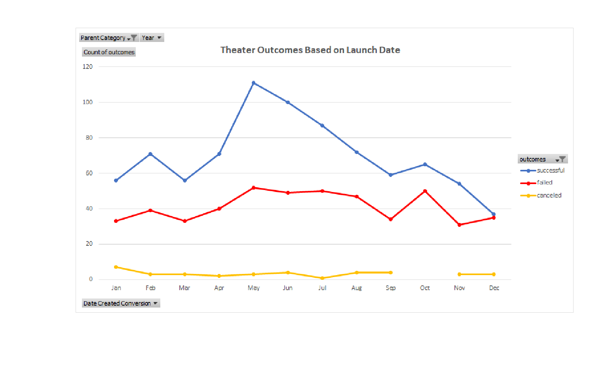
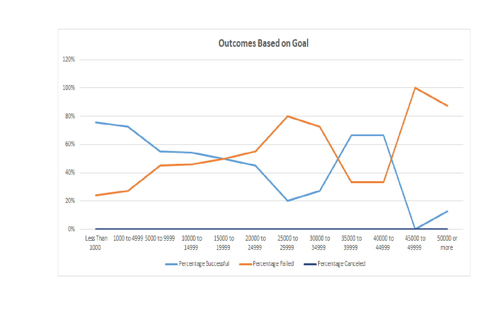

# Kickstarter-analysis
Analysis on Kickstarter data with excel

## Overview of Project 
  Using Excel Pivot table, formulas and graphs to create and analyze outcomes based on goals and outcomes based on launch date.

### Purpose 
  To determine the possiblity for successful campaign based on funding goals and launch date.

## Analysis and Challenges

### Analysis of Outcomes Based on Launch Date 
  The month of May has the highest number of successful campaigns.  The month of October has the highest number of failed campaigns.  Note that in December the number of both successful campaigns and failed campaigns are almost equal.
  
 

### Analysis of Outcomes Based on Goals
  Goals with less than $1,000 have the highest successful outcomes and least failure.
  Goals with $45,000 and above have the highest failed outcomes.
  One interesting note, goals between $35,000 to $45,000 have higher rate of successful outcomes and lower rate of failed outcomes.
  
   

### Challenges and Difficulties Encountered

  One of the challenges I encountered was using the Pivot table. I had difficulty deciding which value to use in the row and column fields. To overcome this I randomly put different values in the boxes and see the changes.

## Results
- Two conclusions I draw about the Outcomes based on Launch Date are:
  1. The month of May is the most successful time to launch a campaign.
  2. The month of October has the highest number of failed campaigns.  So, to have a best chance of success a campaign should be launching in May.

- One conclusion about the Outcomes based on Goals is that small goals, less than $1000, have better chance for success than large goals.
  
- Some limitations of this dataset are:
  1. No data concerning a specific regions, city, or state within a country.  Knowing where to start a campaign is important for successful outcome.
  2. No data regarding age group.  It's important to know what age group to target certain campaign. For example, type of music, type of foods, etc.
  
- Some other possible tables and/or graphs that we could create are Outcomes based on country, Outcomes based on backers_count, or Outcomes based on Staff_pick.
